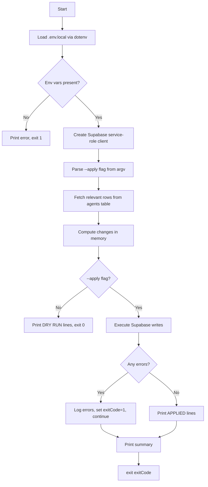

# Design Document — agents-db-cleanup

## Overview

This feature delivers six standalone Node.js `.mjs` scripts that clean, enrich, and validate the Supabase `agents` table. The scripts address four confirmed data-quality issues: 19 duplicate rows, 24 missing high-value tools, French text in description/array fields, and incorrect `use_cases` values. A fifth script adds missing URLs, and a sixth generates a post-cleanup validation report.

All scripts share a common execution model:
- Load credentials from `stackai/.env.local` via `dotenv`
- Connect to Supabase using the service-role key
- Default to **dry-run mode** — no writes unless `--apply` is passed
- Print `[DRY RUN]` or `[APPLIED]` prefixes on every change line
- Exit `0` on success, `1` if any error occurred

The scripts are plain `.mjs` files (ES modules, no TypeScript compilation required) placed in `stackai/scripts/`.

---

## Architecture

```
stackai/
├── scripts/
│   ├── db-deduplicate.mjs          # Req 1 — remove duplicate agents
│   ├── db-add-missing-tools.mjs    # Req 2 — insert 24 missing tools
│   ├── db-translate-to-english.mjs # Req 3 — translate French fields
│   ├── db-fix-use-cases.mjs        # Req 4 — fix incorrect use_cases
│   ├── db-add-urls.mjs             # Req 5 — populate missing URLs
│   └── db-validate.mjs             # Req 6 — generate validation report
└── .env.local                      # NEXT_PUBLIC_SUPABASE_URL + SUPABASE_SERVICE_ROLE_KEY
```

### Execution Flow (all scripts)



### Shared Utilities

Each script is self-contained but follows the same boilerplate pattern established by the existing `analyze-db-quality.mjs` script:

```js
import { createClient } from '@supabase/supabase-js'
import dotenv from 'dotenv'
import { fileURLToPath } from 'url'
import { dirname, join } from 'path'

const __dirname = dirname(fileURLToPath(import.meta.url))
dotenv.config({ path: join(__dirname, '../.env.local') })

const { NEXT_PUBLIC_SUPABASE_URL: url, SUPABASE_SERVICE_ROLE_KEY: key } = process.env
if (!url || !key) {
  console.error('ERROR: NEXT_PUBLIC_SUPABASE_URL and SUPABASE_SERVICE_ROLE_KEY must be set in .env.local')
  process.exit(1)
}

const supabase = createClient(url, key)
const DRY_RUN = !process.argv.includes('--apply')
const PREFIX = DRY_RUN ? '[DRY RUN]' : '[APPLIED]'
```

---

## Components and Interfaces

### 1. `db-deduplicate.mjs`

**Responsibility:** Detect and remove duplicate agent rows (same `name`, case-insensitive), retaining the most complete record.

**Completeness scoring function:**

```
completenessScore(agent) =
  (agent.url ? 3 : 0)           // URL is highest priority (logo display)
  + (agent.description?.length ?? 0) / 100  // longer description = more complete
  + (agent.score ?? 0) / 100    // higher score = more complete
```

**Selection rule:** Within each duplicate group, retain the agent with the highest completeness score. On tie, retain the earliest `created_at`.

**Key operations:**
1. `SELECT id, name, url, description, score, created_at FROM agents`
2. Group by `name.toLowerCase()`
3. For each group with size > 1, compute completeness scores and select the keeper
4. In `--apply` mode: `DELETE FROM agents WHERE id IN (loser_ids)`

**Output per deleted row:**
```
[DRY RUN] DELETE id=abc123 name="Perplexity Pro" reason="duplicate of id=def456 (higher completeness)"
```

**Summary:**
```
Deduplication complete: 19 duplicates found, 19 rows deleted (or would be deleted)
```

---

### 2. `db-add-missing-tools.mjs`

**Responsibility:** Insert the 24 missing high-value tools with complete English data.

**Static data constant** (`TOOLS_TO_ADD`): An array of 24 agent objects, each with all required fields populated. See Data Models section for the full list.

**Key operations:**
1. `SELECT name FROM agents` — build a set of existing names (lowercased)
2. For each tool in `TOOLS_TO_ADD`: skip if name already exists, otherwise insert
3. In `--apply` mode: `INSERT INTO agents (...) VALUES (...)`

**Output per inserted tool:**
```
[DRY RUN] INSERT name="Gemini" category="copywriting" url="https://gemini.google.com"
```

**Summary:**
```
Import complete: 18 tools inserted, 6 skipped (already exist)
```

---

### 3. `db-translate-to-english.mjs`

**Responsibility:** Detect French text in `description`, `use_cases`, `best_for`, and `not_for` fields and replace with English equivalents.

**French detection heuristic:**

```js
const FRENCH_INDICATORS = [
  /\b(avec|pour|les|des|une|est|dans|sur|par|qui|que|pas|plus|très|aussi|mais|donc|car|ou|et)\b/i,
  /[àâäéèêëîïôùûüç]/,  // French-specific accented characters
]

function isFrench(text) {
  return FRENCH_INDICATORS.some(re => re.test(text))
}
```

**Translation approach:** The scripts use a **static translation map** (`TRANSLATIONS`) rather than calling an external LLM API. This keeps the scripts self-contained, fast, and free to run. The translation map covers all French strings found in the current `agents_export.json` data. This is the correct approach because:
- The dataset is finite and known (exported from the DB)
- LLM API calls would add cost, latency, and external dependencies to a maintenance script
- The French strings are repetitive (same phrases appear across many agents)

**Key operations:**
1. `SELECT id, description, use_cases, best_for, not_for FROM agents`
2. For each agent, check each field with `isFrench()`
3. Apply translations from the static map
4. In `--apply` mode: `UPDATE agents SET description=..., use_cases=..., best_for=..., not_for=... WHERE id=...`

**Output per updated agent:**
```
[DRY RUN] UPDATE id=abc123 name="Perplexity Pro" fields=[description, best_for, not_for]
```

---

### 4. `db-fix-use-cases.mjs`

**Responsibility:** Apply targeted `use_cases` corrections from a configuration object.

**Configuration format:**

```js
const USE_CASE_FIXES = [
  {
    name: 'Lindy',
    remove_tags: ['reporting'],
    add_tags: ['email_automation', 'workflow_automation'],
  },
  // Additional fixes can be added here without code changes
]
```

**Key operations:**
1. `SELECT id, name, use_cases FROM agents WHERE name IN (fix_names)`
2. For each fix: remove `remove_tags`, add `add_tags` (deduped), ensure length >= 2
3. In `--apply` mode: `UPDATE agents SET use_cases=... WHERE id=...`

**Output per corrected agent:**
```
[DRY RUN] UPDATE name="Lindy" removed=["reporting"] added=["email_automation","workflow_automation"] result=["email_automation","workflow_automation","ai_assistant"]
```

---

### 5. `db-add-urls.mjs`

**Responsibility:** Populate `url` and `website_domain` for agents that have a null or empty `url`.

**Static URL map** (`URL_MAP`): A `Map<string, string>` keyed by agent name (lowercased) mapping to canonical HTTPS URLs. Covers all agents in the current dataset that are missing URLs.

**Domain derivation:**

```js
function extractDomain(url) {
  return new URL(url).hostname.replace(/^www\./, '')
}
```

**Key operations:**
1. `SELECT id, name, url FROM agents WHERE url IS NULL OR url = ''`
2. For each agent: look up name in `URL_MAP`
3. In `--apply` mode: `UPDATE agents SET url=..., website_domain=... WHERE id=...`

**Output per updated agent:**
```
[DRY RUN] UPDATE name="Zapier" url="https://zapier.com" website_domain="zapier.com"
```

**Summary:**
```
URL enrichment complete: 312 URLs added, 525 agents still missing URL
```

---

### 6. `db-validate.mjs`

**Responsibility:** Query the `agents` table and produce a structured quality report.

**Report structure:**

```ts
interface ValidationReport {
  generated_at: string          // ISO timestamp
  total_agents: number
  missing_url: number
  missing_description: number
  missing_use_cases: number
  duplicate_names: number
  french_text_remaining: number
  category_distribution: Record<string, number>
  agents_missing_url: string[]  // names of agents without URL
  duplicate_groups: Array<{ name: string; count: number }>
}
```

**Output:** Written to `scripts/agents-db-validation-report.json` and printed as a human-readable summary to stdout.

---

## Data Models

### Agent Row (from `types.ts` + VectorAgent fields)

| Field | Type | Notes |
|---|---|---|
| `id` | `string` (UUID) | Auto-generated by Supabase |
| `name` | `string` | Unique (enforced by deduplication) |
| `category` | `string` | One of: `automation`, `copywriting`, `customer_service`, `image`, `prospecting`, `seo`, `analytics`, `coding`, `research`, `video`, `website` |
| `description` | `string` | English, non-empty |
| `pricing_model` | `'free'|'freemium'|'paid'|'usage'` | |
| `price_from` | `number` | Monthly USD price (0 for free) |
| `score` | `number` | 0–100 quality score |
| `roi_score` | `number` | 0–100 ROI score |
| `use_cases` | `string[]` | At least 2 English tags |
| `compatible_with` | `string[]` | |
| `url` | `string` | Canonical HTTPS URL |
| `last_updated` | `string` | ISO date |
| `best_for` | `string[]` | At least 2 English values |
| `not_for` | `string[]` | |
| `integrations` | `string[]` | |
| `website_domain` | `string` | Derived from `url` hostname |
| `setup_difficulty` | `string` | `'easy'`, `'medium'`, `'hard'` |
| `time_to_value` | `string` | e.g. `'1 day'`, `'1 week'` |

### 24 Missing Tools — Static Data (`TOOLS_TO_ADD`)

| Name | Category | Pricing Model | Price From | URL |
|---|---|---|---|---|
| Gemini | copywriting | freemium | 0 | https://gemini.google.com |
| Taplio | automation | paid | 49 | https://taplio.com |
| Mailchimp | automation | freemium | 0 | https://mailchimp.com |
| Zapier | automation | freemium | 0 | https://zapier.com |
| Shopify | website | paid | 29 | https://shopify.com |
| Tidio AI | customer_service | freemium | 0 | https://tidio.com |
| Semrush | seo | paid | 119 | https://semrush.com |
| Notion | automation | freemium | 0 | https://notion.so |
| Zendesk | customer_service | paid | 55 | https://zendesk.com |
| Perplexity AI | research | freemium | 0 | https://perplexity.ai |
| Writesonic | copywriting | freemium | 0 | https://writesonic.com |
| Later | automation | freemium | 0 | https://later.com |
| Sprout Social | automation | paid | 249 | https://sproutsocial.com |
| ActiveCampaign | automation | paid | 29 | https://activecampaign.com |
| Shopify Sidekick | automation | free | 0 | https://shopify.com/sidekick |
| Gorgias | customer_service | paid | 10 | https://gorgias.com |
| Seamless.ai | prospecting | freemium | 0 | https://seamless.ai |
| Surfer SEO | seo | paid | 89 | https://surferseo.com |
| DALL-E | image | usage | 0 | https://openai.com/dall-e-3 |
| Stable Diffusion | image | free | 0 | https://stability.ai |
| Synthesia | video | paid | 22 | https://synthesia.io |
| Google Analytics | analytics | free | 0 | https://analytics.google.com |
| Windsurf | coding | freemium | 0 | https://codeium.com/windsurf |
| Tavily | research | freemium | 0 | https://tavily.com |

Each tool will also include `description`, `use_cases` (≥2), `best_for` (≥2), `not_for`, `score`, `roi_score`, `setup_difficulty`, and `time_to_value` fields populated with accurate English data in the script source.

---

## Correctness Properties

*A property is a characteristic or behavior that should hold true across all valid executions of a system — essentially, a formal statement about what the system should do. Properties serve as the bridge between human-readable specifications and machine-verifiable correctness guarantees.*

### Property 1: Duplicate detection completeness

*For any* array of agent objects containing groups of agents with identical names (case-insensitive), the duplicate-detection function SHALL identify every such group and SHALL NOT report any false positives (agents with distinct names).

**Validates: Requirements 1.1**

---

### Property 2: Best-candidate selection

*For any* group of duplicate agents, the selection function SHALL retain exactly the agent with the highest completeness score (url present > description length > score), and on tie, the agent with the earliest `created_at`.

**Validates: Requirements 1.2, 1.3**

---

### Property 3: Dry-run produces zero database mutations

*For any* input dataset and any cleanup script (deduplicate, add-missing-tools, translate, fix-use-cases, add-urls), running without the `--apply` flag SHALL result in zero Supabase write calls (INSERT, UPDATE, DELETE).

**Validates: Requirements 1.6, 3.6, 4.5, 5.5, 7.3**

---

### Property 4: Missing-tool insertion is idempotent

*For any* database state (any subset of the 24 tools already present), running the import script SHALL insert exactly the tools that are absent and skip exactly the tools that are already present, such that `inserted_count + skipped_count = 24`.

**Validates: Requirements 2.1, 2.4, 2.5**

---

### Property 5: All tool definitions are complete and valid

*For every* tool object in the `TOOLS_TO_ADD` constant, all required fields (`name`, `category`, `description`, `use_cases` with ≥2 elements, `best_for` with ≥2 elements, `url`, `price_from`, `score`, `pricing_model`) SHALL be non-null, non-empty, and `pricing_model` SHALL be one of `'free'`, `'freemium'`, `'paid'`, `'usage'`.

**Validates: Requirements 2.2, 2.3**

---

### Property 6: French detection correctly classifies text

*For any* string containing at least one French indicator word or French-specific accented character, the `isFrench()` function SHALL return `true`. *For any* string composed entirely of common English words without French indicators, `isFrench()` SHALL return `false`.

**Validates: Requirements 3.1**

---

### Property 7: Translation eliminates French text

*For any* agent whose `description`, `use_cases`, `best_for`, or `not_for` fields are detected as French, after applying the translation function, none of those fields SHALL be detected as French by `isFrench()`.

**Validates: Requirements 3.2, 3.3**

---

### Property 8: Translation preserves array structure

*For any* array of strings, applying the translation function SHALL produce an array of the same length with no null or empty elements.

**Validates: Requirements 3.4**

---

### Property 9: Use-case corrections are fully applied

*For any* configuration array of `{ name, remove_tags, add_tags }` corrections, after applying the fix function, every specified `remove_tag` SHALL be absent from the agent's `use_cases` and every specified `add_tag` SHALL be present, and the resulting `use_cases` array SHALL have at least 2 elements.

**Validates: Requirements 4.1, 4.2, 4.3**

---

### Property 10: URL derivation is correct

*For any* valid HTTPS URL string, the `extractDomain()` function SHALL return the hostname portion without the `www.` prefix, protocol, or path.

**Validates: Requirements 5.3**

---

### Property 11: URL enrichment applies all known mappings

*For any* agent whose name exists in `URL_MAP` and whose current `url` is null or empty, after applying URL enrichment the agent's `url` SHALL equal `URL_MAP[name]` and `website_domain` SHALL equal `extractDomain(URL_MAP[name])`.

**Validates: Requirements 5.2, 5.3**

---

### Property 12: Validation report metrics are accurate

*For any* set of agents, each metric in the validation report (total count, missing URL count, missing description count, missing use_cases count, duplicate count, French text count, category distribution) SHALL equal the value computed by independently querying the same dataset.

**Validates: Requirements 6.1, 6.2, 6.3, 6.4, 6.5, 6.6, 6.7**

---

### Property 13: Error resilience — processing continues after failures

*For any* batch of agents where a subset of Supabase write calls fail, the script SHALL process all remaining agents in the batch and SHALL NOT throw an uncaught exception.

**Validates: Requirements 7.6**

---

## Error Handling

### Environment Variable Validation

All scripts validate env vars before any database operation:

```js
if (!process.env.NEXT_PUBLIC_SUPABASE_URL || !process.env.SUPABASE_SERVICE_ROLE_KEY) {
  console.error('ERROR: NEXT_PUBLIC_SUPABASE_URL and SUPABASE_SERVICE_ROLE_KEY must be set in .env.local')
  process.exit(1)
}
```

### Supabase API Errors

Each write operation is wrapped in error handling that logs and continues:

```js
const { error } = await supabase.from('agents').update(data).eq('id', id)
if (error) {
  console.error(`ERROR: Failed to update "${name}": ${error.message}`)
  hasErrors = true  // tracked for exit code
  // continue to next record
}
```

### Exit Codes

- `0`: All operations completed (even if some were skipped)
- `1`: At least one Supabase API error occurred, or required env vars were missing

### Batch Processing

Scripts process agents in batches of 10–20 with a 100ms sleep between batches to avoid Supabase rate limits, following the pattern established in `vector-fix/scripts/migrate_to_supabase.mjs`.

---

## Testing Strategy

### PBT Applicability Assessment

This feature is well-suited for property-based testing. The core logic of each script — duplicate detection, completeness scoring, French detection, translation, use-case correction, URL derivation, and report aggregation — consists of pure functions that operate on in-memory data structures. These functions have clear input/output behavior, universal properties that hold across a wide input space, and are cheap to run 100+ times.

The Supabase I/O layer is NOT suitable for PBT (external service, high cost per call). PBT applies to the pure logic layer; integration tests cover the Supabase interaction.

### Property-Based Testing Library

Use **[fast-check](https://github.com/dubzzz/fast-check)** (JavaScript/Node.js). Install as a dev dependency:

```bash
npm install --save-dev fast-check
```

Each property test runs a minimum of **100 iterations** (fast-check default). Tag format in test comments:

```
// Feature: agents-db-cleanup, Property N: <property_text>
```

### Unit Tests (example-based)

Cover specific scenarios not addressed by property tests:
- Env var validation: script exits with code 1 when vars are missing
- `[DRY RUN]` / `[APPLIED]` prefix formatting
- Summary output format
- JSON report file contains all required fields
- Lindy's `use_cases` no longer contains `"reporting"` after fix

### Integration Tests

Cover Supabase interaction with a test database or mocked client:
- Deduplication actually deletes rows in `--apply` mode
- Import actually inserts rows in `--apply` mode
- Translation actually updates rows in `--apply` mode
- Validation report is written to the correct file path

### Test File Structure

```
stackai/scripts/
├── __tests__/
│   ├── db-deduplicate.test.mjs
│   ├── db-add-missing-tools.test.mjs
│   ├── db-translate-to-english.test.mjs
│   ├── db-fix-use-cases.test.mjs
│   ├── db-add-urls.test.mjs
│   └── db-validate.test.mjs
```

### Property Test Examples

```js
// Feature: agents-db-cleanup, Property 1: Duplicate detection completeness
fc.assert(fc.property(
  fc.array(agentArbitrary(), { minLength: 2 }),
  fc.array(fc.string({ minLength: 1 }), { minLength: 1 }),
  (agents, duplicateNames) => {
    // Inject known duplicates with varying case
    const withDuplicates = [...agents, ...duplicateNames.map(n => makeAgent(n.toUpperCase()))]
    const groups = detectDuplicates(withDuplicates)
    return duplicateNames.every(n =>
      groups.some(g => g[0].name.toLowerCase() === n.toLowerCase() && g.length >= 2)
    )
  }
), { numRuns: 100 })

// Feature: agents-db-cleanup, Property 8: Translation preserves array structure
fc.assert(fc.property(
  fc.array(fc.string({ minLength: 1 }), { minLength: 1, maxLength: 10 }),
  (arr) => {
    const translated = translateArray(arr)
    return translated.length === arr.length && translated.every(s => s && s.length > 0)
  }
), { numRuns: 100 })

// Feature: agents-db-cleanup, Property 10: URL derivation is correct
fc.assert(fc.property(
  fc.webUrl({ validSchemes: ['https'] }),
  (url) => {
    const domain = extractDomain(url)
    return !domain.startsWith('www.') && !domain.includes('://') && !domain.includes('/')
  }
), { numRuns: 100 })
```
